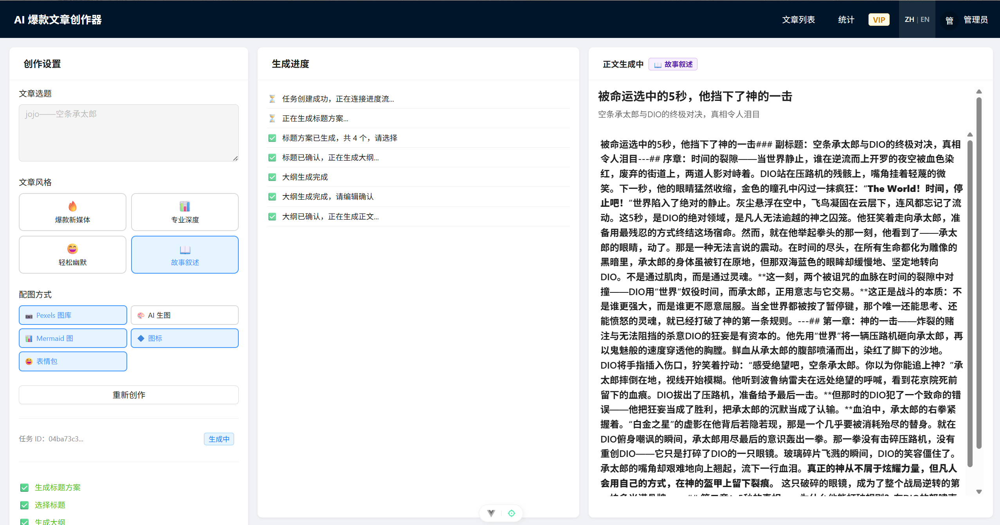
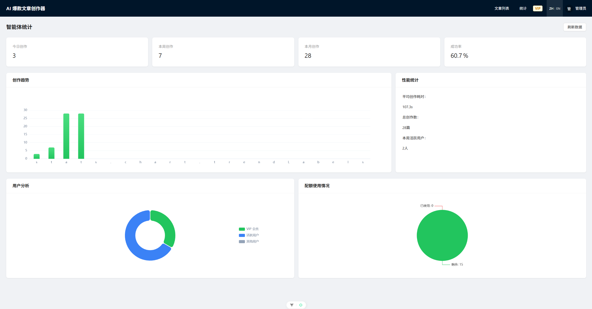
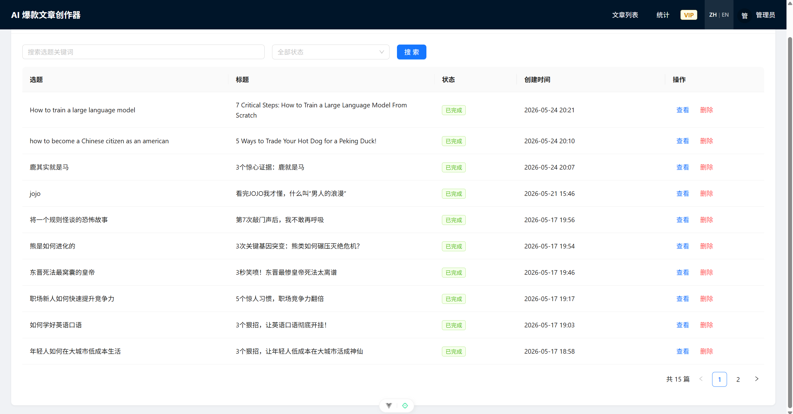
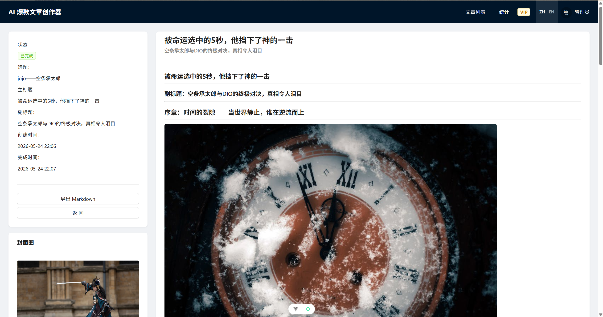

# ArticRAFT · AI 爆款文章创作器

> 基于多智能体编排的 AI 全流程文章生成平台，支持中英双语、人机协作三阶段流程与并行配图生成。


---

## 截图

| 文章创作流程 | 统计仪表盘 |
|---|---|
|  |  |

| 文章列表 | 文章详情 |
|---|---|
|  |  |

---

## 功能特性

### 🤖 多智能体编排
- **5 个专职 Agent**：标题生成 → 大纲生成 → 正文生成 → 配图需求分析 → 图文合成
- **并行配图**：asyncio.Semaphore 控制并发，多节配图同时生成，速度提升 3×
- **三阶段 Human-in-the-Loop**：标题选择 → 大纲编辑 → 内容生成，每阶段均可人工介入

### ⚡ 实时流式推送
- Server-Sent Events（SSE）全程推送生成进度
- 断线自动重连，taskId 持久化到 URL，刷新不丢进度

### 🖼️ 多样化配图
| 方式 | 说明 |
|---|---|
| Pexels | 高质量版权图搜索 |
| Picsum | 随机占位图（降级方案）|
| 腾讯云 COS | 实际上传并返回公网 URL |
| Mermaid | AI 生成流程图/架构图 |
| Iconify | 矢量图标 |
| Emoji Pack | Emoji 配图 |

### 💳 会员与支付
- Stripe Checkout 支付集成
- Webhook 自动更新 VIP 状态
- 免费用户配额控制（每人 5 篇）

### 📊 执行日志与统计
- 每个 Agent 自动埋点执行耗时与状态
- 管理员统计仪表盘（今日/本周/本月/成功率/用户分布）
- ECharts 可视化

### 🌐 中英双语
- 前端 vue-i18n 全站国际化，Header 一键切换语言
- 后端 AI Prompt 双语版本，生成中文或英文文章

---

## 技术架构

```
┌─────────────────────────────────────────────┐
│              Vue 3 前端                      │
│  Ant Design Vue · ECharts · vue-i18n · SSE  │
└───────────────────┬─────────────────────────┘
                    │ HTTP / SSE
┌───────────────────▼─────────────────────────┐
│           FastAPI 后端                       │
│                                             │
│  ArticleAgentOrchestrator                   │
│  ├── Agent1: 标题生成                        │
│  ├── Agent2: 大纲生成                        │
│  ├── Agent3: 正文生成                        │
│  ├── Agent4: 配图需求分析                    │
│  └── ParallelImageGenerator                 │
│      ├── Agent5a ──┐                        │
│      ├── Agent5b ──┼── asyncio.Semaphore    │
│      └── Agent5c ──┘                        │
│                                             │
│  Services: article / image / user /         │
│            analytics / payment              │
└──────┬─────────────┬───────────────┬────────┘
       │             │               │
    MySQL 8       Redis 7        DeepSeek AI
```

---

## 快速开始

### 前置要求

- Docker & Docker Compose
- Python 3.10+（推荐用 [uv](https://docs.astral.sh/uv/)）
- Node.js 20+

### 1. 启动基础服务

```bash
docker compose up -d
```

MySQL 8 和 Redis 7 会自动启动并初始化数据库。

### 2. 配置后端环境

```bash
cd python-backend
cp .env.example .env
# 编辑 .env，填入你的 API Key
```

必填项：
- `DEEPSEEK_API_KEY` — 到 [platform.deepseek.com](https://platform.deepseek.com) 申请
- `SESSION_SECRET_KEY` — 随机字符串，生产环境务必修改

可选项（按需开启）：
- `PEXELS_API_KEY` — [pexels.com/api](https://www.pexels.com/api/)，启用 Pexels 配图
- `TENCENT_COS_*` — 腾讯云 COS，启用图片实际上传
- `STRIPE_*` — 启用 VIP 支付功能

### 3. 启动后端

```bash
cd python-backend
uv sync
uv run uvicorn main:app --reload --port 8567
```

API 文档：http://localhost:8567/docs

### 4. 启动前端

```bash
cd vue-frontend
npm install
npm run dev
```

访问：http://localhost:5173

---

## 项目结构

```
articraft/
├── python-backend/          # FastAPI 后端
│   ├── app/
│   │   ├── routers/         # API 路由层
│   │   ├── services/        # 业务服务层
│   │   │   ├── article/     # 文章相关服务
│   │   │   ├── image/       # 配图生成服务
│   │   │   ├── user/        # 用户服务
│   │   │   ├── analytics/   # 统计分析服务
│   │   │   └── payment/     # 支付服务
│   │   ├── models/          # SQLAlchemy ORM 模型
│   │   ├── schemas/         # Pydantic 数据结构
│   │   └── constants/       # 常量与 Prompt 定义
│   ├── tests/               # pytest 单元测试
│   ├── .env.example         # 环境变量模板（复制为 .env 后填入密钥）
│   └── main.py
├── vue-frontend/            # Vue 3 前端
│   └── src/
│       ├── views/           # 页面组件
│       ├── components/      # 公共组件
│       ├── api/             # API 请求封装
│       ├── locales/         # i18n 中英文翻译
│       └── stores/          # Pinia 状态管理
├── docker/
│   └── mysql/init/          # 数据库初始化 SQL
├── docker-compose.yml       # 一键启动 MySQL 8 + Redis 7
└── README.md
```

---

## 开发历程

本项目经历 8 个核心功能阶段迭代完成：

| 阶段 | 功能 |
|------|------|
| 1 | 项目初始化，技术选型 |
| 2 | 5智能体编排 + SSE + 异步任务 + 文章 CRUD |
| 3 | 前端完整流程（用户认证 + 文章创作） |
| 4 | 多配图方式 + 文章风格选择 + COS 上传 |
| 5 | Human-in-the-Loop 三阶段 + SSE 断线重连 |
| 6 | VIP 会员 + Stripe 支付 |
| 7 | 智能体执行日志 + ECharts 统计仪表盘 |
| 8 | 并行配图架构（Orchestrator + Semaphore）|
| +  | 服务层重构 + 全站 i18n 双语支持 |

---

## 示例输出

[`docs/articles/第7次敲门声后，我不敢再呼吸.md`](docs/articles/第7次敲门声后，我不敢再呼吸.md) — 一篇由本平台生成的完整文章，含标题、大纲、正文与配图。

---

## License

[MIT](LICENSE)
